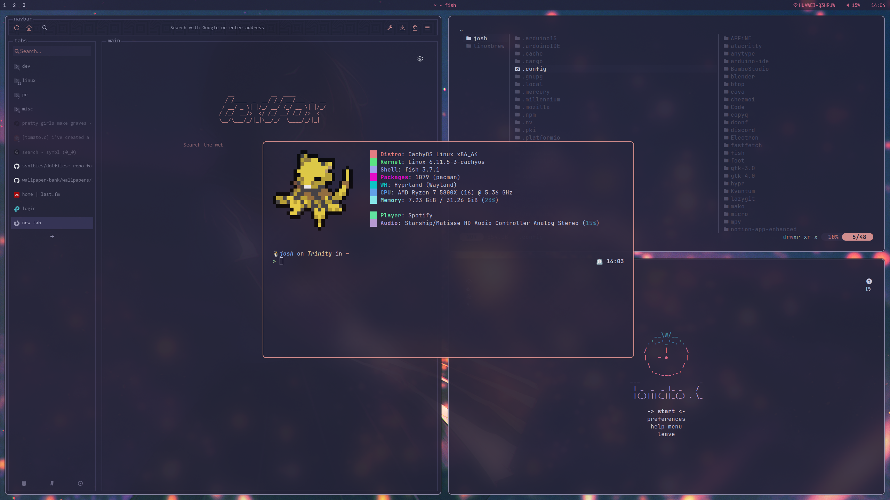

---

# Dotfiles

## 🛠️ Installation Guide

### Prerequisites

Ensure [`chezmoi`](https://www.chezmoi.io/) is installed:

📦 Installation Methods

**Alpine Linux**

```bash
apk add chezmoi
```

**Arch-based Systems**

```bash
sudo pacman -S chezmoi
```

**NixOS/Nixpkgs**

```bash
nix-env -i chezmoi
```

**Other Platforms**
See official [`installation guide`](https://www.chezmoi.io/install/)

---

## 🚀 Quick Start

```bash
# 1. Backup existing configs
mkdir -p ~/dotfiles_backup/{config,dotfiles}
cp -r ~/.config/* ~/dotfiles_backup/config 2>/dev/null || true
cp -r ~/.* ~/dotfiles_backup/dotfiles 2>/dev/null || true

# 2. Initialize repository
chezmoi init https://github.com/Ssnibles/dotfiles.git

# 3. Preview changes
chezmoi diff --color=always | less -R

# 4. Apply configuration
chezmoi apply -v

# 5. Enable auto-updates (optional)
crontab -l | { cat; echo "0 12 * * * chezmoi update -v"; } | crontab -
```

---

## 🔄 Maintenance Guide

| Command | Description |
|---------|-------------|
| `chezmoi update -v` | Pull latest changes + apply |
| `chezmoi edit` | Edit managed files safely |
| `chezmoi re-add` | Sync manual changes to source |
| `chezmoi verify` | Validate config integrity |
| `chezmoi doctor` | Diagnose potential issues |

---

## 🧩 Customization Tips

1. **Personal Overrides**: Place machine-specific files in `~/.local/share/chezmoi/private_*`
2. **Selective Application**: Use `chezmoi apply ~/.config/nvim` to target specific paths
3. **Template Variables**: Modify `.chezmoi.yaml` for host-specific parameters

---

## 🆘 Troubleshooting

**Issue**: Merge conflicts after update<br>
**Solution**:

```bash
chezmoi merge --interactive
```

**Issue**: Missing dependencies<br>
**Solution**:

Run the insall script (all the dependencies ***should*** be in there )

```bash
~/install_script.sh
```

## ✅ Project Status

> [!TODO]
>
> - [ ] 👾 Make the config more universal
> - [ ] 📜 Automated dependency installer (OS-specific)
> - [ ] 🔄 CI/CD testing pipeline
> - [ ] 📚 Some better documentation
>

---
